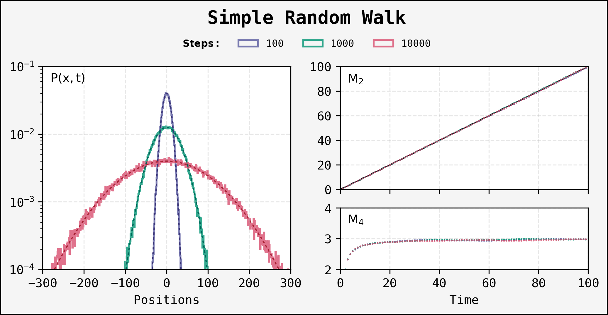

# Random Walks
### Statistics of Random Walks with Resetting and Memory
**Introducing Random Walk models and the study of their statistical properties**

## Description
In this project, we study the Random Walk (a succession of random steps) in a discrete lattice, through the distribution of **final positions** (their
position *x* at a time *N*), or the distribution of the **visits** (all the positions in their path), as well as the statistical properties of these
distribution: variance, skewness, kurtosis. We consider, aside from the simple random walk, two models:
- Resetting: Walkers can be relocated to their initial position with a probability.
- Memory: Walkers can be placed in one of the places they visited previously.

<div style="background: '#fff'; widht:30%;">
  
</div>

## Usage
The project simulations are performed on Fortran, using the OMP Library. The results are collected in a Jupyter Notebook and presented as we unroll the
theory behind the models.

### Running the Fortran programs.
To run a program, you have to compile the Fortran code using the OMP library; in addition, *-O2* is recommended:
```bash
gfortran -fopenmp program_name.f90 -o program_name -O2
set OMP_NUM_THREADS = "number of threads"
```
[More details about OMP](https://curc.readthedocs.io/en/latest/programming/OpenMP-Fortran.html). The "number of threads" depends on your computer and
the number of threads you want to use. Now, Fortran will create an executable file *.exe*, but you can also run the program from the console:
```bash
./program_name
```

### Results
After execution, each Fortran program creates a set of *.txt* files stored inside the *data* folder. The contents of these files are:
- **Information:** Relevant information about the program, such as the number of realizations, the number of steps, maximum distance for the distributions, etc.
- **Cases:** The different cases simulated: varying the *steps* for the simple random walk, and the *probability* for resetting and memory.
- **Distribution:** Lists of integers with the total counts (non-normalized).
- **Statistical Properties:** Lists of *variance*, *skewness*, and *kurtosis*.
- **Raw Moments:** Lists of the variables used to calculate the statistical properties.

## Example Output
The following is an example of the results included in the *RandomWalkResults.ipynb*:
<div style='align-content: center;'>
  
  <p style='font-size:8px;'>Properties of the distributions of simple random walkers</p>
</div>

## Acknowledgments
*This work was developed under the supervision of Dr. Thomas Gorin and Dr. Soham Biswas.*

## License
This project is licensed under the GNU General Public License v3.0 ([LICENSE](LICENSE))
